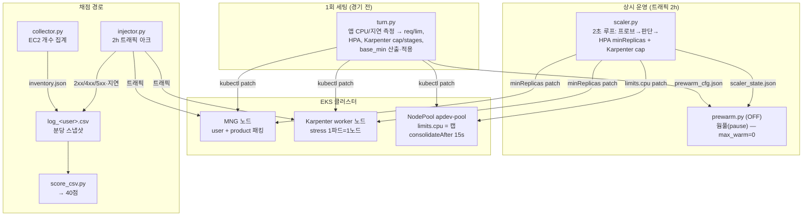
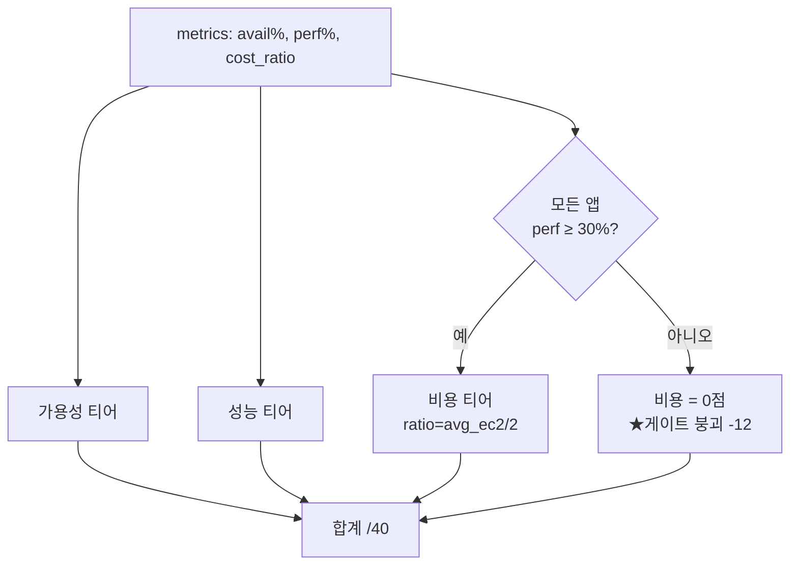
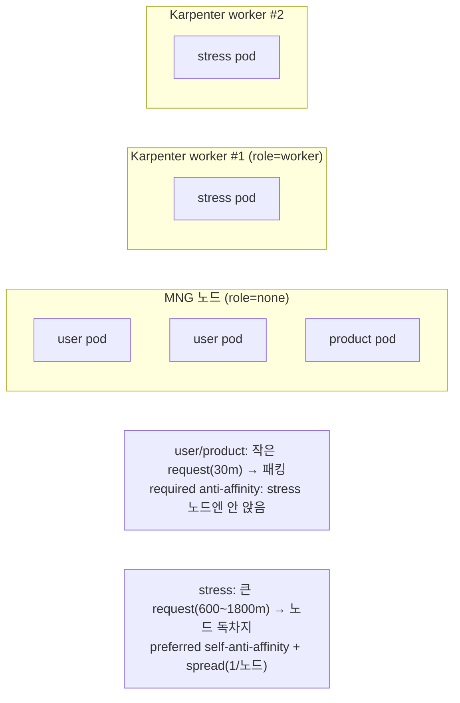
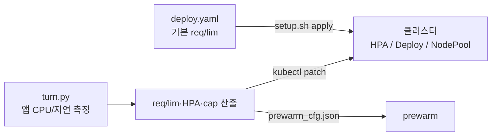
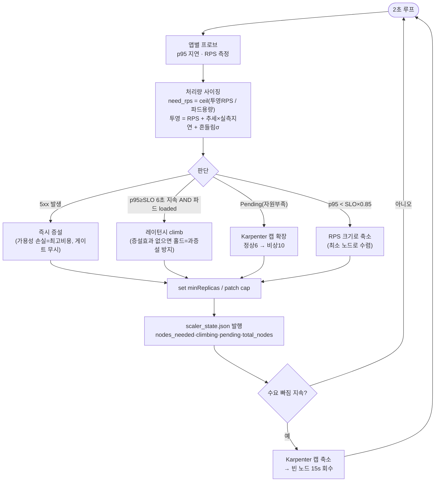

# WSC2026 Day3 — System Operation 설계 문서 (DESIGN.md)

> 목적: 코드 라인이 아니라 **전체 동작 프로세스·흐름**을 이해하기 위한 문서.
> 핵심 철학: **"채점 공식에 맞추지 않는다. 트래픽을 다 잘 처리하고 + 최소 노드로 운영한다"** —
> 이 둘만 지키면 어떤 앱·패턴·채점 방식이 와도 고득점이 나온다.

---

## 0. 한 장 요약

- **앱 3종**: `user`·`product`(IO/DB, SLO 200ms, MNG에 패킹) + `stress`(CPU, SLO 1000ms, 전용 노드).
- **자동 운영 툴 3종**: `turn.py`(1회 세팅) → `scaler.py`(상시 스케일) → `prewarm.py`(웜풀, **현재 OFF**).
- **채점**: `score_csv.py` — 가용성/성능/비용/비정상 = 40점. **비용 12점은 "모든 앱 성능≥30%"일 때만 열림(게이트).**
- **불변식**: 정상 노드 ≤ 6, 비상(Pending 시만) ≤ 10. 비용 = 2시간 평균 인스턴스 수.

---

## 1. 컴포넌트 지도



---

## 2. 채점 모델 (score_csv.py) — 무엇을 최적화하는가

**PDF 루브릭 40점:**

| 항목 | 배점 | 계산 |
|---|---|---|
| 비정상 처리 | 4 | image_download 티어(2) + exception_handling 티어(2) |
| 고가용성 | 12 | user/product/stress 각 4 (2xx 비율) |
| 성능 효율성 | 12 | user/product/stress 각 4 (SLO 이내 비율) |
| **비용 최적화** | **12** | `cost_ratio` 티어 — **단, 모든 앱 성능 ≥ 30%일 때만** |

**티어 (누적, 임계 통과 시 +점):**
- 가용성/성능: `90·87.5·85·82.5·80·70·50·30` → 각 0.5점 (≥90%면 만점 4).
- 비용: `cost_ratio = avg_ec2 / 2`, 임계 `1.00·1.25·…·3.75` → 값이 **작을수록** 많이 받음.



**결론(이 문서의 근거):**
- **비용 = 평균 노드 수의 함수.** 평균 EC2가 0.5대 줄 때마다 대략 +1점. → **"최소 노드"가 곧 점수.**
- **게이트**: 아무 앱이나 성능 30% 밑으로 떨어지면 **비용 12점 전부 0.** → **"트래픽 다 처리(SLO 유지)"가 비용의 전제.**
- 그래서 두 목표 = ①모든 앱 SLO 유지 ②최소 노드. 채점식을 몰라도 이 둘이면 고득점.

---

## 3. 노드 아키텍처 & 배치 (질문 3 답)



**핵심 배치 규칙 (deploy.yaml, 선언적 = 자동):**
- **stress 격리**: `user`/`product`에 **required podAntiAffinity(app=stress)** → user/product는 **절대 stress 노드에 안 앉음.** → stress가 CPU 경합 없이 노드를 독차지(성능·게이트 보호).
- **stress 분산**: stress는 **preferred self-anti-affinity + topologySpread(maxSkew 1)** → 노드 여유 있으면 1파드=1노드로 격리, 없으면 공존(Pending 방지).
- **user/product 패킹**: 작은 request(30m) + topologySpread(maxSkew 6, ScheduleAnyway) → 여러 파드가 소수 MNG 노드에 몰림(노드 안 늘림 = 비용).
- **우선순위**: stress=high-priority(노드 경쟁 승리), user/product=normal.

**부하 심할 때 "분리"는 스크립트가 아니라 자동:**
- stress 부하↑ → HPA/scaler가 stress 파드↑ → 각 파드가 anti-affinity로 **새 worker 노드를 자동 확보**(Karpenter) → 앱별 노드가 자연 분리됨.
- 별도 "노드 분리 스크립트"는 필요 없음 — **anti-affinity(선언적) + Karpenter(자동 프로비저닝)** 가 그 역할.

---

## 4. Request/Limit 설정 방식 (질문 2 답)

**앱마다 개별 설정 O — 2단계:**

1. **기본값 (K8s manifest)**: `k8s/deploy.yaml`에 앱별 resources 명시.
   | 앱 | request | limit | 의미 |
   |---|---|---|---|
   | user | cpu 30m / mem 32Mi | (없음) | 작게 → MNG 패킹 |
   | product | cpu 30m / mem 32Mi | (없음) | 작게 → 패킹 |
   | stress | cpu 600m / mem 128Mi | cpu 2000m / mem 512Mi | 크게 → 노드 독차지, GOMAXPROCS 2 |

2. **런타임 재조정 (turn.py, 실측 기반)**: `turn.py`가 각 앱 실제 CPU/지연을 측정해 req/lim·HPA util·min/max를 **다시 계산**하고 `kubectl patch`로 적용. → 앱이 무거우면 자동으로 request↑, 가벼우면↓ (하드코딩 아님).



---

## 5. 스케일링 제어 루프 (scaler.py) — "트래픽 다 처리 + 최소 노드"

2초 주기로 각 앱을 **다신호**로 판단해 HPA `minReplicas`(하한)와 Karpenter `limits.cpu`(캡)를 조절.



**과증설을 막는 안전장치 (앱 무관, 일반):**
- **loaded 게이트**(파드당 부하 < 35%면 지연 나빠도 증설 안 함) → DB/앱 병목에 노드 낭비 방지.
- **증설효과 판정**(증설 후 p95 안 줄면 홀드 + "앱 바닥" 경고) → 도달 불가 목표 추격 차단.
- **측정 기반 여유율**(추세×실측 부팅시간 + σ) → 고정 배수 아님, 어떤 부하에도 성립.
- **Karpenter consolidation 15s** + prewarm OFF → 빈 노드·웜 churn 없이 빠르게 회수.

---

## 6. 노드 캡: 정상은 낮게, 비상은 높게 (일반화 핵심)


- **정상(6)**: 평상시 비용을 낮게 유지.
- **비상(10, Pending 전용)**: 실제 대회 앱이 연습보다 무거워도 **캡에 막혀 성능 붕괴 → 비용 게이트 0(−12점)** 되는 걸 방지. Pending 게이트가 막아 **평상시 비용은 0**.
- 근거: 게이트 붕괴(−12)가 비상 노드 몇 대 비용보다 압도적으로 비싸다.

---

## 7. 엔드투엔드 데이터 흐름

```mermaid
sequenceDiagram
  participant I as injector.py
  participant A as 앱(user/product/stress)
  participant S as scaler.py
  participant C as collector.py
  participant F as log_&lt;user&gt;.csv
  participant Sc as score_csv.py

  loop 매 초
    I->>A: 트래픽(아크 패턴, fire-and-forget)
    A-->>I: 2xx/4xx/5xx + 지연 (X-Attest 검증)
  end
  loop 2초
    S->>A: 프로브(p95, RPS)
    S->>A: minReplicas / 캡 조절
    S->>S: scaler_state.json 발행
  end
  loop 주기
    C->>C: AWS EC2 개수 집계 → inventory.json
  end
  loop 매 60초
    I->>F: 앱별 2xx/4xx/5xx, p50/p95, under_sla, ec2_count
  end
  Note over Sc: 경기 후
  Sc->>F: 읽기
  Sc-->>Sc: 가용성·성능·비용 티어 → 40점
```

---

## 8. "왜 이 설계가 어떤 앱에도 고득점인가" (일반화 논리)

| 앱 특성 | 대응 (자동) |
|---|---|
| CPU 무거움 | HPA(CPU) + RPS 사이징 + Pending 확장(→10) |
| 지연 무거움(IO/DB) | 상주를 MNG에 넉넉히(노드 0 추가) + 레이턴시 컨트롤러 |
| 급증/스파이크 | 5xx 즉시대응 + Pending 확장 (반응형 = 비용 최소) |
| 지속 고부하 | RPS 비례 사이징 (딱 필요한 만큼) |
| 무엇이든 | 정상≤6 유지(비용) · Pending 시만 →10(게이트 방어) · 빈 노드 15s 회수 |

- **비용**: 항상 필요한 최소 노드 + 빠른 회수 → avg_ec2 최소 → 비용 점수 최대.
- **성능/가용성**: 다신호 스케일로 모든 앱 SLO 유지 → 게이트 통과 + 성능 점수.
- **채점식이 달라도**: "SLO 다 지키고 노드 최소"면 어떤 비용/성능 채점이든 상위.

---

## 9. 운영 순서 (요약)

1. `python turn.py <노드타입>` — 앱 측정 → req/lim·HPA·cap·상주 적용 (1회).
2. `python scaler.py <endpoint>` — 상시 스케일 (경기 내내).
3. (prewarm 미사용 — `max_warm=0`.)
4. 경기 후 `python score_csv.py data/log_*.csv` — 점수 확인.

> 파일 참조: `tools/turn.py`, `tools/scaler.py`, `tools/prewarm.py`, `k8s/deploy.yaml`,
> `k8s/karpenter.yaml`, `loadtest/injector.py`, `loadtest/collector.py`, `loadtest/score_csv.py`.

---

# 부록 A. 2026-08-19 실측으로 갱신된 부분

이 세션에서 채점 서버로 15개 회차를 돌려 실측한 결과다. 위 본문과 **충돌하는 항목**은
아래가 우선한다. 근거는 모두 실측이며 상세는 `tools/tuner/VALIDATION.md` 에 있다.

## A-1. 비용 지표는 "EKS 노드 수"가 아니라 "계정 running EC2 전체 수"다

채점 `collector.py` 의 `count_ec2` 는 `describe_instances` 를 **필터 없이** 센다.

```python
for page in paginator.paginate(Filters=[{"Name":"instance-state-name","Values":["running","pending"]}]):
    for r in page["Reservations"]:
        count += len(r["Instances"])
```

그래서 **설치용 bastion 도 1대로 잡힌다. 그 한 대가 비용 2점이다.**

과제 스펙도 같은 방향이다 — "EC2 인스턴스는 **t3.medium 타입만**",
"불필요한 리소스를 생성한 경우 감점 (e.g. **미사용 EC2**)". t3.small bastion 은 두 조항 모두에 걸린다.

EKS API 가 퍼블릭이면 설치 후 kubectl 은 로컬에서 그대로 된다. 그래서 terraform 에
`bastion_enabled` 를 두고, 설치가 끝나면 `terraform apply -var bastion_enabled=false` 로 없앤다.

**실측: bastion 제거만으로 36.0 → 38.5.**

## A-2. stress 전용 노드는 항상 옳지 않다 — 트래픽에 달렸다

본문은 stress 를 전용 노드에 고정하는 전제였다. 실측은 다르다.

| 트래픽 | 최적 배치 | 점수 |
|---|---|---|
| stress 1.25 rps (기본 x0.5) | **동거** | 40.0 (격리는 37.0) |
| stress 7 rps | **전용 2대** | 32.0 (동거는 22.5) |

전용 노드 1대는 비용 2점이다. stress 수요가 그 값어치를 못 하면 손해다.
반대로 stress 가 포화하면 비용 게이트가 터져 12점이 통째로 날아간다.

경계는 stress 앱의 처리 한계로 정한다 — **파드 1개(2코어)가 4~5 rps 에서 포화**한다
(`concurrency.sh` 실측). 다른 앱의 20분의 1 수준이다.

## A-3. 성능을 좌우하는 것은 노드 수가 아니라 "user/product 가 쓸 수 있는 코어 수"

| 구성 | 공유 코어 | user 통과율 |
|---|---|---|
| 2노드 격리 | 2 | 63.8% |
| 2노드 동거 | 4 (stress 와 공유) | 86.9% |
| 3노드 격리 | 4 (전용) | 97.0% |
| 5노드 격리 | 8 | 96.8% |

지연의 대부분은 **줄 서는 시간**이다. 요청 하나의 CPU 는 13.6ms 인데 채점이 본 지연은 180ms 였다.
동시성을 걸어 재현했다:

```
동시성  1 → user POST  20.1ms
동시성 20 → user POST 104.2ms      (20 × 13.6ms ÷ 2코어 = 136ms 와 일치)
```

평균 CPU 이용률은 32% 로 한가해 보이는데, 순간 몰림이 대기를 만든다.
그래서 평균 기반 모델(ρ, `1/(1-ρ)`)로는 이 지연을 못 만든다 — 예측이 전부 99.8% 로 나온다.

**주의**: 단발 프로브는 큐를 안 만들어 항상 빠르게 나온다. 내부 프로브 15.6ms 를 믿고
"지연은 네트워크 탓"이라 결론냈다가 ALB `TargetResponseTime`(160~180ms)에 반박당했다.
반드시 동시성을 걸어 재야 한다.

## A-4. stress 의 `cpu.requests` 가 성능 레버다

리눅스 CFS 는 노드가 경합할 때 CPU 를 컨테이너의 `requests` 비율로 나눈다.
기본값은 stress 600m : user 70m ≈ **8.6:1** 이라 동거 시 user 가 밀린다.

같은 2노드 동거 구성에서 `requests` 만 바꾼 실측:

| stress requests | user | stress | 합계 |
|---|---|---|---|
| 600m (기본) | 84.73% | 94.64% | 38.5 |
| 200m | 89.29% | 93.78% | 39.5 |
| **100m** | **93.27%** | **92.39%** | **40.0** |

`requests` 는 상한이 아니다. 상한은 `limits` 이고 그건 건드리지 않는다(stress `limits.cpu=2` 유지).
노드가 한가하면 stress 는 여전히 필요한 만큼 쓴다. 경합 순간의 배분만 달라진다.
단, stress 가 90% 티어를 깨면 이득이 사라지므로 **두 값을 같이 보고** 조절해야 한다.

## A-5. 노드 수 제어: `minDomains`(하한) + `limits.cpu`(상한) + NodeClaim 회수(축소)

- Karpenter 는 **Pending 파드를 봐야** 노드를 만든다. 스케줄 가능한 노드가 1대뿐이면
  `topologySpread` 의 skew 가 항상 0 이라 파드가 Pending 되지 않는다 → 노드가 안 늘어난다.
  `minDomains: N` 이 도메인 N 개가 될 때까지 파드를 Pending 시켜 Karpenter 를 깨운다.
- 상한(`NodePool.spec.limits.cpu`)이 없으면 HPA 가 늘리는 만큼 노드가 계속 붙는다 (**실측 9대**).
- **축소는 자동으로 안 된다.** `limits.cpu` 를 낮춰도 이미 뜬 노드는 안 지워지고,
  `topologySpread` 때문에 Karpenter 의 통합 시뮬레이션도 막힌다(몇 분을 기다려도 그대로).
  초과분만큼 **NodeClaim 을 직접 회수**해야 한다. 공유 풀과 stress 풀 **둘 다** 해당한다.
- `nodeTaintsPolicy: Honor` 로 stress 전용 노드를 도메인 계산에서 제외한다. 없으면 그 노드가
  "영원히 0개인 도메인"이 되어 maxSkew 를 계속 위반하고 노드가 무한 증식한다.

## A-6. 공유 노드는 최소 2대

1대로 줄이면 두 가지가 깨진다.

1. 고가용성(12점) — user/product 가 한 노드에만 있으면 그 노드가 죽을 때 전면 중단이다.
2. 실측: 공유 1대(2코어) 구성에서 HPA 가 늘린 파드 6개가 자리를 못 찾아 **Pending** 됐다.

## A-7. 운영 도구는 `tools/tuner/` 로 대체

본문의 `scaler.py` 상시 스케일 루프 대신, 측정 기반 도구를 쓴다.

| 도구 | 역할 |
|---|---|
| `autotune.sh` | **메인.** ALB 지표로 트래픽을 읽고 → 계산 → 적용. 채점 서버 접근이 필요 없다 |
| `concurrency.sh` | 앱의 동시성-지연 곡선 실측 (앱당 약 1분) |
| `solve.py` | 곡선 + 트래픽 → 최적 노드 수·stress 배치 (비용 게이트 반영) |
| `apply.sh` | 구성 고정 (`minDomains` + `limits.cpu` + NodeClaim 회수) |
| `tune_requests.sh` | stress CPU 지분 조정 |

대회는 **인프라 구축에 1시간**만 준다. 그 안에 들어가는 절차는 `tools/tuner/RUNBOOK-1H.md` 에 있다.
핵심은 `profile.sh`(앱당 5분)를 버리고 `concurrency.sh`(앱당 1분)만 쓰는 것이다.

## A-8. 한계 — 과부하 붕괴 구간은 예측하지 못한다

정상 구간에서는 정확하다 (트래픽을 어떻게 흔들어도 **예측 오차 0.5점**).
그러나 시스템이 무너지는 구간은 못 맞춘다.

앱을 2배 무겁게(`LOAD_MULT` 0.3→0.6) 했을 때 **예측 35.5 vs 실측 16.5**.
모델에 **타임아웃이 없기** 때문이다. stress 응답이 12.5초까지 늘자 주입기가 실패 처리했고
가용성이 54.96% 로 떨어졌는데, 모델은 "지연이 길어진다"까지만 계산한다.

그래서 모델과 별개로 **증상 기반 방어**를 넣었다 (`autotune.sh` 의 `overload_nodes`):
ALB `TargetResponseTime` 이 SLA 를 넘으면 계산을 기다리지 않고 노드를 늘린다.
과부하 붕괴는 회복이 느려서, 예측보다 반응이 중요하다.

## A-9. stress 에 CPU `limits` 를 걸면 손해다

"stress 부하가 강할 때 limit 으로 조여 user 를 보호"는 자연스러운 발상이라 직접 재봤다.
stress 7rps, 2노드 동거(노드 수 고정해 리밋 효과만 분리):

| stress `limits.cpu` | user | product | stress | 가용성 |
|---|---|---|---|---|
| 없음 | 85.75 | 108.63 | 26.13 | 전부 100% |
| 2 (기본) | 84.88 | 107.76 | 26.04 | 전부 100% |
| **1** | 83.73 | 99.57 | **9.86** | **product 91.41 / stress 96.04** |

- `limits.cpu: 2` 는 t3.medium(2 vCPU)에서 노드 크기와 같아 **사실상 무제한**이다("없음"과 동일 결과).
- 조여도 **user 는 안 오른다** (84.88 → 83.73).
- 대신 **가용성이 깨진다** — 리밋에 걸린 stress 가 느려지며 압박이 옆 앱으로 번져
  product 가용성이 91.41% 까지 떨어졌다. 리밋 없을 때는 세 앱 모두 100% 였다.

보호는 `requests` 로 한다 — 경합할 때만 비율대로 배분하고 스로틀링이 없다 (A-4 참조).
그리고 비용 게이트(성능 30%) 때문에 stress 를 희생시키는 전략 자체가 막혀 있다.
stress 부하가 크면 조이는 게 아니라 **CPU 를 더 줘야 한다**(전용 노드). 실측 22.5 vs 32.0.

## A-10. 시작 구성: 하한은 고정, 상한은 열어둔다

과제지는 트래픽 **양을 알려주지 않는다**("경기 시작 1시간 뒤부터 발생"만 명시).
그래서 트래픽이 오기 전에 최적값을 확정하는 것은 원리상 불가능하다.

시작 시점에는 **하한(`minDomains`)과 상한(`NodePool.limits.cpu`)을 분리**한다.

```bash
./apply.sh 2 shared 6      # 하한 2대, 상한 6대
```

- 하한 2대 — 비용 만점 지점이자 고가용성 최소선. 트래픽이 가벼우면 여기 머문다.
- 상한 6대 — 스파이크가 오면 Karpenter 가 늘릴 수 있게 열어둔다.

**상한까지 묶으면 안 된다.** 실측: 노드 2대로 상한까지 고정한 상태에서 stress 가 7rps 로
오르자 파드가 Pending 되고 stress 성능이 26% 로 떨어져 비용 게이트가 터졌다(22.5점).

점수는 트래픽 구간 **평균**이다. 초반 몇 분 노드가 한 대 더 도는 비용보다
성능 붕괴(성능 12점 + 비용 게이트 12점)가 훨씬 비싸다.

트래픽이 시작되면 `autotune.sh run` 이 실제 rps 를 재서 최적 구성을 계산하고,
그 시점에 상한을 하한까지 좁혀 비용을 확정한다.
