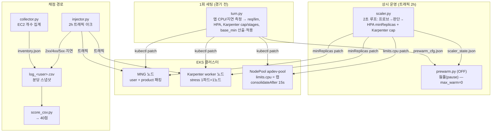
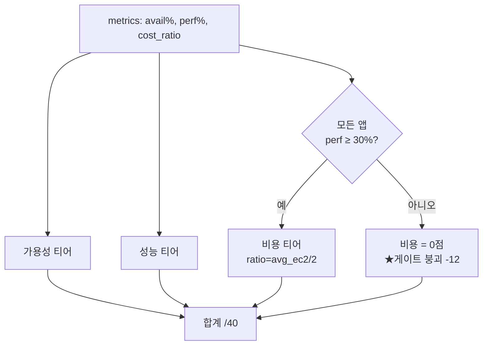
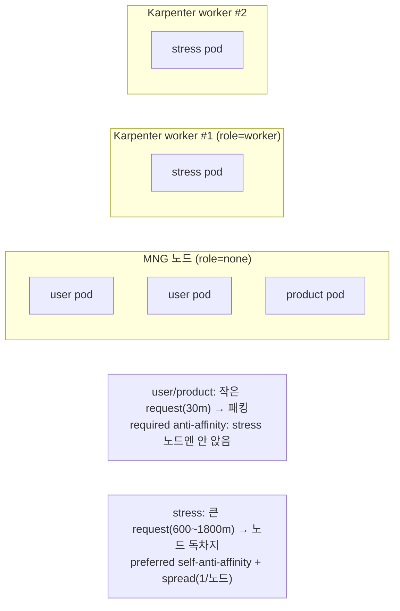
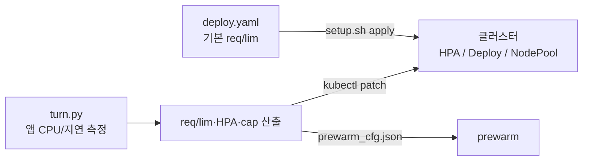

# WSC2026 Day3 — System Operation 설계 문서 (DESIGN.md)

> 목적: 코드 라인이 아니라 **전체 동작 프로세스·흐름**을 이해하기 위한 문서.
> 핵심 철학: **"채점 공식에 맞추지 않는다. 트래픽을 다 잘 처리하고 + 최소 노드로 운영한다"** —
> 이 둘만 지키면 어떤 앱·패턴·채점 방식이 와도 고득점이 나온다.

---

## 0. 한 장 요약

- **앱 3종**: `user`·`product`(IO/DB, SLO 200ms, MNG에 패킹) + `stress`(CPU, SLO 1000ms, 전용 노드).
- **자동 운영 툴 3종**: `turn.py`(1회 세팅) → `scaler.py`(상시 스케일) → `prewarm.py`(웜풀, **현재 OFF**).
- **채점**: `score_csv.py` — 가용성/성능/비용/비정상 = 40점. **비용 12점은 "모든 앱 성능≥30%"일 때만 열림(게이트).**
- **불변식**: 정상 노드 ≤ 6, 비상(Pending 시만) ≤ 10. 비용 = 2시간 평균 인스턴스 수.

---

## 1. 컴포넌트 지도



---

## 2. 채점 모델 (score_csv.py) — 무엇을 최적화하는가

**PDF 루브릭 40점:**

| 항목 | 배점 | 계산 |
|---|---|---|
| 비정상 처리 | 4 | image_download 티어(2) + exception_handling 티어(2) |
| 고가용성 | 12 | user/product/stress 각 4 (2xx 비율) |
| 성능 효율성 | 12 | user/product/stress 각 4 (SLO 이내 비율) |
| **비용 최적화** | **12** | `cost_ratio` 티어 — **단, 모든 앱 성능 ≥ 30%일 때만** |

**티어 (누적, 임계 통과 시 +점):**
- 가용성/성능: `90·87.5·85·82.5·80·70·50·30` → 각 0.5점 (≥90%면 만점 4).
- 비용: `cost_ratio = avg_ec2 / 2`, 임계 `1.00·1.25·…·3.75` → 값이 **작을수록** 많이 받음.



**결론(이 문서의 근거):**
- **비용 = 평균 노드 수의 함수.** 평균 EC2가 0.5대 줄 때마다 대략 +1점. → **"최소 노드"가 곧 점수.**
- **게이트**: 아무 앱이나 성능 30% 밑으로 떨어지면 **비용 12점 전부 0.** → **"트래픽 다 처리(SLO 유지)"가 비용의 전제.**
- 그래서 두 목표 = ①모든 앱 SLO 유지 ②최소 노드. 채점식을 몰라도 이 둘이면 고득점.

---

## 3. 노드 아키텍처 & 배치 (질문 3 답)



**핵심 배치 규칙 (deploy.yaml, 선언적 = 자동):**
- **stress 격리**: `user`/`product`에 **required podAntiAffinity(app=stress)** → user/product는 **절대 stress 노드에 안 앉음.** → stress가 CPU 경합 없이 노드를 독차지(성능·게이트 보호).
- **stress 분산**: stress는 **preferred self-anti-affinity + topologySpread(maxSkew 1)** → 노드 여유 있으면 1파드=1노드로 격리, 없으면 공존(Pending 방지).
- **user/product 패킹**: 작은 request(30m) + topologySpread(maxSkew 6, ScheduleAnyway) → 여러 파드가 소수 MNG 노드에 몰림(노드 안 늘림 = 비용).
- **우선순위**: stress=high-priority(노드 경쟁 승리), user/product=normal.

**부하 심할 때 "분리"는 스크립트가 아니라 자동:**
- stress 부하↑ → HPA/scaler가 stress 파드↑ → 각 파드가 anti-affinity로 **새 worker 노드를 자동 확보**(Karpenter) → 앱별 노드가 자연 분리됨.
- 별도 "노드 분리 스크립트"는 필요 없음 — **anti-affinity(선언적) + Karpenter(자동 프로비저닝)** 가 그 역할.

---

## 4. Request/Limit 설정 방식 (질문 2 답)

**앱마다 개별 설정 O — 2단계:**

1. **기본값 (K8s manifest)**: `k8s/deploy.yaml`에 앱별 resources 명시.
   | 앱 | request | limit | 의미 |
   |---|---|---|---|
   | user | cpu 30m / mem 32Mi | (없음) | 작게 → MNG 패킹 |
   | product | cpu 30m / mem 32Mi | (없음) | 작게 → 패킹 |
   | stress | cpu 600m / mem 128Mi | cpu 2000m / mem 512Mi | 크게 → 노드 독차지, GOMAXPROCS 2 |

2. **런타임 재조정 (turn.py, 실측 기반)**: `turn.py`가 각 앱 실제 CPU/지연을 측정해 req/lim·HPA util·min/max를 **다시 계산**하고 `kubectl patch`로 적용. → 앱이 무거우면 자동으로 request↑, 가벼우면↓ (하드코딩 아님).



---

## 5. 스케일링 제어 루프 (scaler.py) — "트래픽 다 처리 + 최소 노드"

2초 주기로 각 앱을 **다신호**로 판단해 HPA `minReplicas`(하한)와 Karpenter `limits.cpu`(캡)를 조절.


**과증설을 막는 안전장치 (앱 무관, 일반):**
- **loaded 게이트**(파드당 부하 < 35%면 지연 나빠도 증설 안 함) → DB/앱 병목에 노드 낭비 방지.
- **증설효과 판정**(증설 후 p95 안 줄면 홀드 + "앱 바닥" 경고) → 도달 불가 목표 추격 차단.
- **측정 기반 여유율**(추세×실측 부팅시간 + σ) → 고정 배수 아님, 어떤 부하에도 성립.
- **Karpenter consolidation 15s** + prewarm OFF → 빈 노드·웜 churn 없이 빠르게 회수.

---

## 6. 노드 캡: 정상은 낮게, 비상은 높게 (일반화 핵심)

```mermaid
flowchart LR
  idle["유휴<br/>2대 (MNG1+stress1)"] -->|부하↑| normal["정상 확장<br/>≤ 6대<br/>(레이턴시/RPS)"]
  normal -->|"파드 Pending<br/>(자원부족 확정)"| emerg["비상 확장<br/>≤ 10대<br/>(Pending일 때만)"]
  emerg -->|부하↓| normal
  normal -->|부하↓| idle
```

- **정상(6)**: 평상시 비용을 낮게 유지.
- **비상(10, Pending 전용)**: 실제 대회 앱이 연습보다 무거워도 **캡에 막혀 성능 붕괴 → 비용 게이트 0(−12점)** 되는 걸 방지. Pending 게이트가 막아 **평상시 비용은 0**.
- 근거: 게이트 붕괴(−12)가 비상 노드 몇 대 비용보다 압도적으로 비싸다.

---

## 7. 엔드투엔드 데이터 흐름

```mermaid
sequenceDiagram
  participant I as injector.py
  participant A as 앱(user/product/stress)
  participant S as scaler.py
  participant C as collector.py
  participant F as log_&lt;user&gt;.csv
  participant Sc as score_csv.py

  loop 매 초
    I->>A: 트래픽(아크 패턴, fire-and-forget)
    A-->>I: 2xx/4xx/5xx + 지연 (X-Attest 검증)
  end
  loop 2초
    S->>A: 프로브(p95, RPS)
    S->>A: minReplicas / 캡 조절
    S->>S: scaler_state.json 발행
  end
  loop 주기
    C->>C: AWS EC2 개수 집계 → inventory.json
  end
  loop 매 60초
    I->>F: 앱별 2xx/4xx/5xx, p50/p95, under_sla, ec2_count
  end
  Note over Sc: 경기 후
  Sc->>F: 읽기
  Sc-->>Sc: 가용성·성능·비용 티어 → 40점
```

---

## 8. "왜 이 설계가 어떤 앱에도 고득점인가" (일반화 논리)

| 앱 특성 | 대응 (자동) |
|---|---|
| CPU 무거움 | HPA(CPU) + RPS 사이징 + Pending 확장(→10) |
| 지연 무거움(IO/DB) | 상주를 MNG에 넉넉히(노드 0 추가) + 레이턴시 컨트롤러 |
| 급증/스파이크 | 5xx 즉시대응 + Pending 확장 (반응형 = 비용 최소) |
| 지속 고부하 | RPS 비례 사이징 (딱 필요한 만큼) |
| 무엇이든 | 정상≤6 유지(비용) · Pending 시만 →10(게이트 방어) · 빈 노드 15s 회수 |

- **비용**: 항상 필요한 최소 노드 + 빠른 회수 → avg_ec2 최소 → 비용 점수 최대.
- **성능/가용성**: 다신호 스케일로 모든 앱 SLO 유지 → 게이트 통과 + 성능 점수.
- **채점식이 달라도**: "SLO 다 지키고 노드 최소"면 어떤 비용/성능 채점이든 상위.

---

## 9. 운영 순서 (요약)

1. `python turn.py <노드타입>` — 앱 측정 → req/lim·HPA·cap·상주 적용 (1회).
2. `python scaler.py <endpoint>` — 상시 스케일 (경기 내내).
3. (prewarm 미사용 — `max_warm=0`.)
4. 경기 후 `python score_csv.py data/log_*.csv` — 점수 확인.

> 파일 참조: `tools/turn.py`, `tools/scaler.py`, `tools/prewarm.py`, `k8s/deploy.yaml`,
> `k8s/karpenter.yaml`, `loadtest/injector.py`, `loadtest/collector.py`, `loadtest/score_csv.py`.
